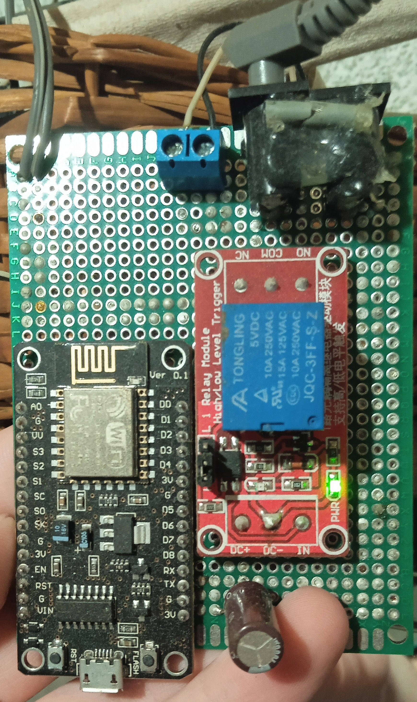
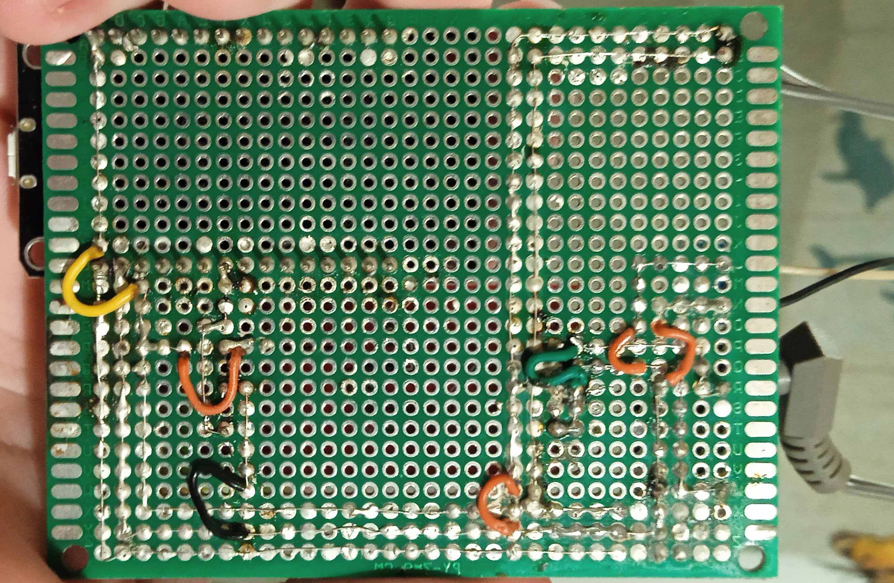

# BasicESP8266WorkSchedule

Basic eplementation of shuduled work on ESP8266.

All you need is:
1)WIFI (with internet acsess)
2)ESP8266
(test setup - power thrue USB)

Hardware setup (My case):



```cpp
const byte PinLed = 2; //Led Pin
const byte PinReley = 12; //Output Pin

const byte HourStart = 8; //Start work after 8:00
const byte HourEnd = 20; //End work after 20:00

byte IntervalHours = 2; //Intervals
byte IntervalMins = 0;
byte IntervalTotalMins = 0;

const int PressTime = 500; //The time the pin is active.
const int OneCycleDeley = 10000; //Main loop delay.
```
