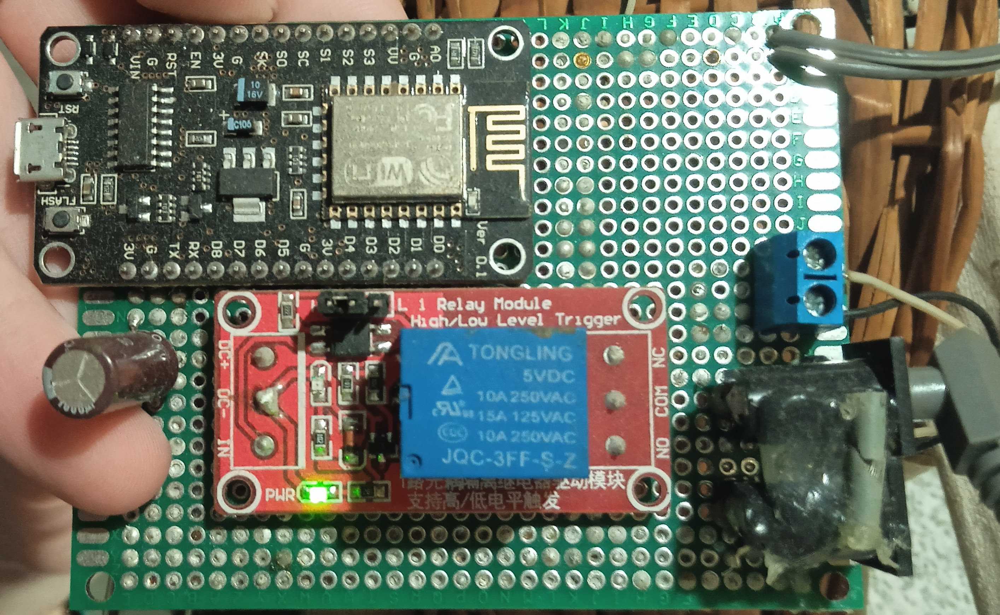

# BasicESP8266WorkSchedule

Basic eplementation of shuduled work on ESP8266.

All you need is:
1)WIFI (with internet acsess)
2)ESP8266
(test setup - power thrue USB)

Hardware setup (My case):



Configuration:
```cpp
const byte PinLed = 2; //Led Pin
const byte PinReley = 12; //Output Pin

const byte HourStart = 8; //Start work after 8:00
const byte HourEnd = 20; //End work after 20:00

byte IntervalHours = 2; //Intervals
byte IntervalMins = 0;
byte IntervalTotalMins = 0;

const int PressTime = 500; //The time the pin is active.
const int OneCycleDeley = 10000; //Main loop delay.
```

And in `credentials.h`
```cpp
const char* ssid = "Your_WIFI_SSID"
const char* password = "PASSWORD";

const char* NTP_SERVER = "ch.pool.ntp.org";
const char* TZ_INFO    = "EET-2EEST,M3.5.0/3,M10.5.0/4";  // enter your time zone (https://remotemonitoringsystems.ca/time-zone-abbreviations.php)
```
